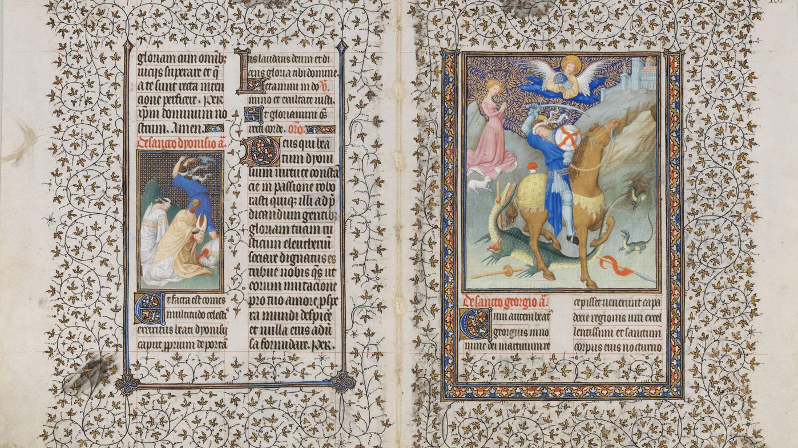
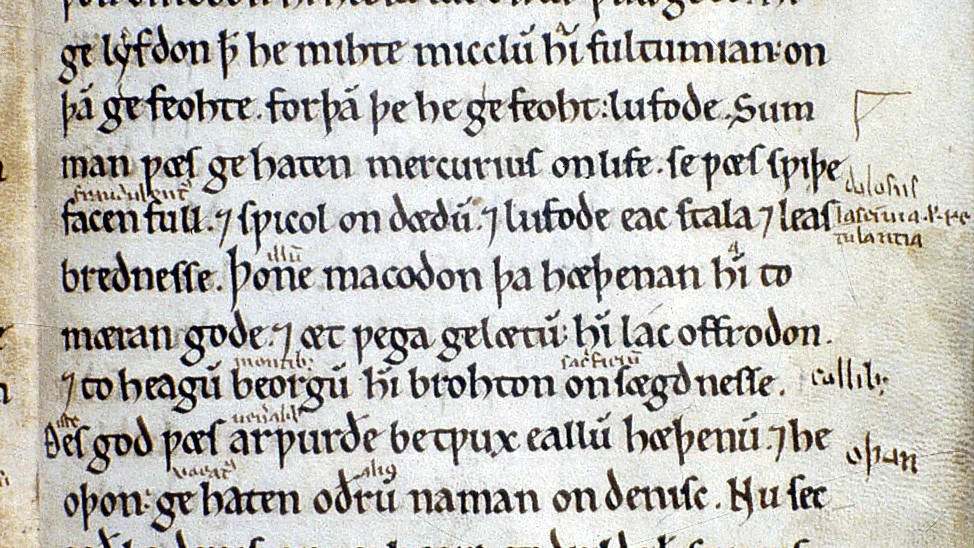

# What Is Codicology? And What About Paleography?

!!! info "A Growing Primer"
    This section introduces selected codicology and paleography topics. It is
    not an exhaustive reference. If there is a script or manuscript type you
    would like to see covered, [open an issue](https://github.com/SexyCodicology/Digitized-Medieval-Manuscripts-app/issues).

## What Does “Codicology” Mean?

The term *codicology* is traced to Alphonse Dain, a French scholar of Byzantine
and Hellenic studies. In *Les manuscrits* (1949), he proposed it as a single
English term for the study of manuscripts. Dain noted that German already had
the term *Handschriftenkunde*. He formed *codicology* from the Latin *codex* or
*codicis*, meaning “book,” and the Greek *-logia*, meaning “the study of a
subject.” The word therefore means the study of books, especially manuscripts.

Codicology is a broad field, but it does not encompass every aspect of
manuscript study. *Paleography*, from the Greek *palaios* and *graphein*, is the
study of ancient handwriting and scripts, including those found in manuscripts.
For examples, see [Caroline
Minuscule](medieval-scripts/caroline-minuscule.md), [Humanistic
Script](medieval-scripts/humanistic-script.md), and [Beneventan
Script](medieval-scripts/beneventan-script.md). Paleography is distinct from,
but complementary to, codicology, with its own methods, terminology, and
theories.

*The Belles Heures of Jean de France, duc de Berry, f 166v 167r*

## Codicology and Paleography

Codicology and paleography both help us study manuscripts. They can overlap in
practice, but they begin with different questions.

- **Codicology focuses on the physical book.** By studying a manuscript’s
  materials, binding, layout, and other features, a codicologist can learn about
  its origin, provenance, dating, and use by past owners. (Timothy Hunter,
  “Codicology,” *The Oxford Companion to Western Art*, Oxford University Press,
  2001.) Codicology generally moves from the whole book to its smaller parts.
- **Paleography focuses on scripts and handwriting.** By analyzing how words
  are written, a paleographer can also investigate a manuscript’s place of
  origin and date. (Peter Beal, “palaeography,” *A Dictionary of English
  Manuscript Terminology 1450–2000*, Oxford University Press, 2008.)
  Paleography often begins with a specific feature of the writing and works
  outward to the wider history of the book.

The distinction is not always straightforward. Both disciplines aim to improve
our understanding of a manuscript and its origins, but they approach that goal
from different directions. Some researchers consider codicology part of
paleography, while others take the opposite view. (Peter Beal, “codicology,”
*A Dictionary of English Manuscript Terminology 1450–2000*, Oxford University
Press, 2008.)

No single term encompasses every question raised by a medieval book. Depending
on your interests and approach, you may work as a paleographer or a
codicologist. When you need help with a particular feature or problem, seek the
advice of someone with relevant expertise.

For example, a paleographer might suggest that manuscript Hatton MS 116,
Oxford, Bodleian Library, was once at Worcester because its glosses were
written by the [Tremulous Hand of
Worcester](https://en.wikipedia.org/wiki/The_Tremulous_Hand_of_Worcester). A
codicologist might reach the same conclusion by examining the parchment,
binding, and layout. Both approaches are valuable research methods.

*Oxford, Bodleian Library, Hatton 116 — [browse the Bodleian's digitized manuscripts on the DMMapp](../libraries/new-digital-bodleian-62.md)*

## Find Digitized Manuscripts!

DMMapp is a small, independent project and a labor of love, fueled by a passion
for history, culture, and medieval manuscripts. For more than a decade, we have
gathered links to digitized medieval manuscripts from archives and libraries
around the world.

[Discover the DMMapp](../index.md){ .md-button .md-button--primary }
