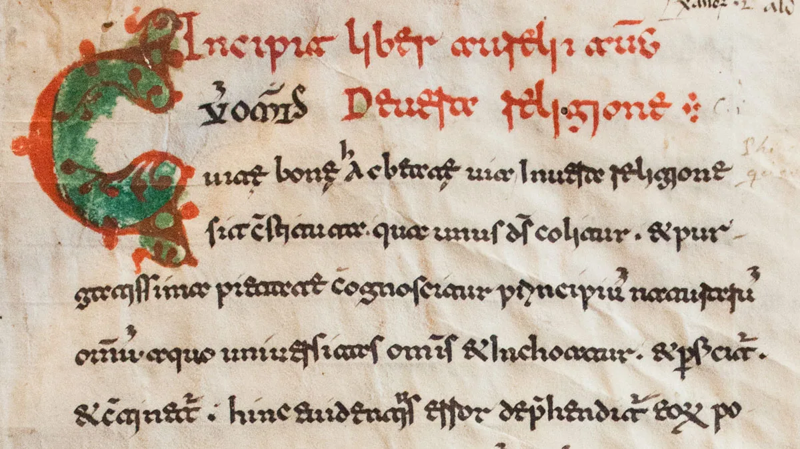
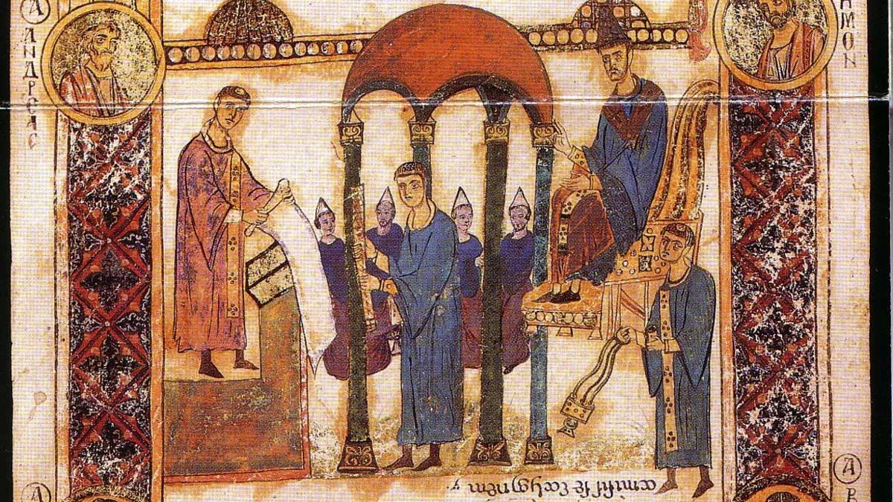
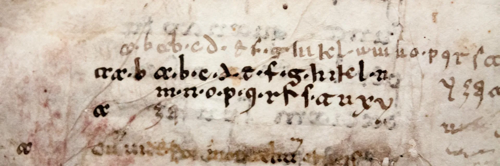

# Beneventan Script

## The Origin of the Name "Beneventan"

The name "Beneventan" script derives from the fact that its major centers of writing were within the duchy of Benevento, in Southern Italy: Monte Cassino, Bari and, obviously, Benevento itself. The monastery of [Monte Cassino](../../libraries/biblioteca-statale-del-monumento-nazionale-di-montecassino-597.md) was extremely influential due to the fact that it was founded by St. Benedict, and through this influence it helped spread the Beneventan Script in Benedictine scriptoria as far as Dalmatia, contemporary Croatia. It's worth knowing that, before the studies by palaeographer Elias Avery Lowe, the script was known as Longobarda or Longobardistica. This nomenclature attributed the paternity of this script to the Lombards, but it was thanks to palaeographer Lowe that the script obtained the name with which it's known today: Beneventan.

(Fun fact: the great-grandson of Elias Avery Lowe is [Boris Johnson](https://en.wikipedia.org/wiki/Boris_Johnson)!)

*Beneventan Script sample from [Monte Cassino](../../libraries/biblioteca-statale-del-monumento-nazionale-di-montecassino-597.md).*

## (Very) Brief History of the Beneventan Script

The history of the script is particularly long: its origin can be traced back to the middle of the 8th century. It was used until the 13th century in Southern Italy and Dalmatia. After that it was still in use until the 15th century in smaller communities. Over this length of time, the script didn't change significantly, adding an extra difficulty to the dating of manuscripts written in it.

### The Exultet Rolls

Most of the surviving objects containing Beneventan script are liturgical material, and among these are the Exultet rolls. These were used in Latin liturgy on the eve of Easter, when the deacon, dressed in white, would sing the "Exultet" from it. The name derives from the incipit:

> *exultet iam angelica turba caelorum…*

Translatable into:

> the heavenly crowd of angels shout for joy...

*From the Bari Exultet Roll. On the left you can see the Deacon unravelling the scroll from the altar. At the bottom, you can see the script, written upside down. Notice also the particular full stop at the end of the text.*

The Exultet roll would also contain decorations and illustrations that appear drawn upside down compared to the text. This is because the roll would have been unfurled by the priest, down from the altar in front of the audience attending the mass. Whoever was celebrating the mass would be able to read the text that was meant to be sung, while people who were unable to understand Latin could look at the images appearing from the scroll as it was unfurled in front of them.

## Beneventan Palaeography

Beneventan script is fairly easy to recognize, and the letters "a" and "t" are the easiest to identify once you know what they look like. They look quite similar to each other: the "a" resembles an "oc" when both letters are touching, and the "t" is very similar, but the top stroke in the "c" of the "oc" shape is flat. Other particular shapes of letters are the "e" and the "r". A sample of the alphabet of this script will help you understand it better than any description:

*Sample of Beneventan script from Monte Cassino — cod. Casin. 269, p. 352.*

To these letterforms you also have to add the small galaxy of ligatures typical of this script: "et", "ex", "ri", etc., and the many non-standardized abbreviations. Also typical of the Beneventan script was the use of a standardized form of punctuation, such as the two points and comma that would indicate a contemporary full stop. All these details make the Beneventan script easy to identify, but fairly difficult to read, until you get used to it.

## Further Reading

There is much, much more to know about this type of script, and there's a wide selection of books from which you can venture deeper into its history:

- *The Scriptorium and Library at Monte Cassino, 1058–1105* (Cambridge Studies in Palaeography and Codicology) — the definitive study on Beneventan Script, 400+ folio pages covering every aspect of it. You might want to pick it up from your local library rather than buying it.
- *Introduction to Manuscript Studies* — recommended if you want to know more about medieval manuscripts in general: production, decoration, and general information. It has a chapter on selected scripts, including the Beneventan Script.
- *The Beneventan Script: A History of the South Italian Minuscule* — written almost a century ago, still extremely useful and interesting. This is the book that gave the name "Beneventan" to this script, previously known as Longobardistica.

*Last edited: February 2017*

Want to see Beneventan manuscripts yourself? [Monte Cassino's digitized collection](../../libraries/biblioteca-statale-del-monumento-nazionale-di-montecassino-597.md) is one of hundreds on the DMMapp.

[Discover the DMMapp](../../index.md){ .md-button .md-button--primary }
