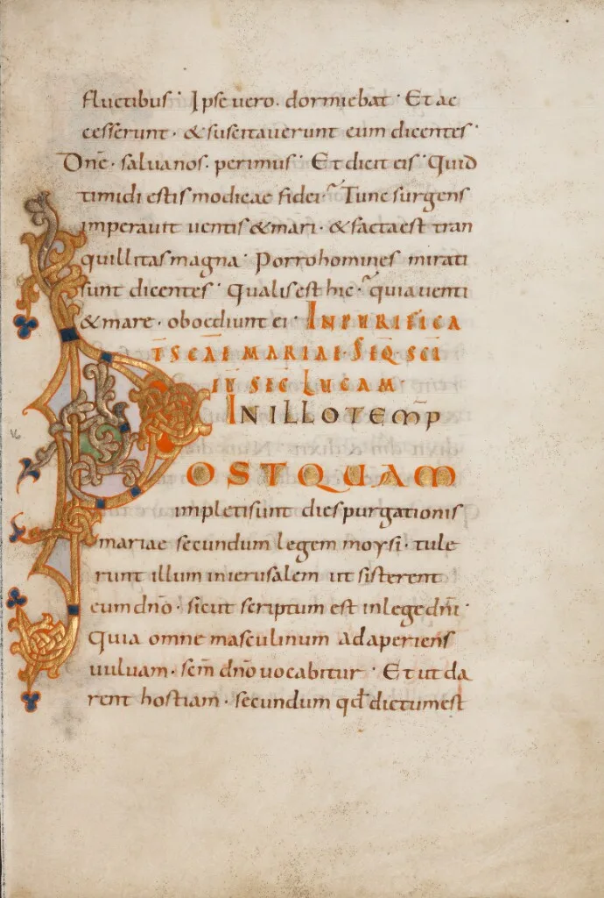

# Caroline Minuscule

Carolingian minuscule, also called Caroline minuscule, emerged in the Carolingian
Empire in the eighth century. It became a standard script for Latin texts and
influenced later scripts, including Gothic and Humanistic hands. Its clarity
made texts easier to read and copy, helping to support literacy. (B. Bischoff,
*Latin Palaeography: Antiquity and the Middle Ages*, Cambridge University Press,
1990, 204.)

## Origin and Characteristics

Carolingian minuscule developed during the reign of Charlemagne, who ruled the
Frankish Empire from 768 to 814 CE. A patron of learning and literacy,
Charlemagne wanted a script that was clearer than the hands then in use. Alcuin
of York, a scholar and adviser to Charlemagne, developed the script. (B.
Bischoff, *Latin Palaeography: Antiquity and the Middle Ages*, Cambridge
University Press, 1990, 210.)

*[Decorated Initial P, Ms. 16 (85.MD.317), fol. 13](https://www.getty.edu/art/collection/object/107SVZ#full-artwork-details), [The J. Paul Getty Museum](../../libraries/the-j-paul-getty-museum-560.md).*

The resulting script was based on traditional Roman writing but used simpler
letterforms and more regular spacing. Its letters are compact, rounded,
consistent in height and width, and easy to distinguish from one another. The
script also uses punctuation, including commas, colons, and periods, and follows
more consistent rules for letter shapes and proportions than its predecessors.

The name “Caroline” derives from the Latin *carolingianus*, meaning “of or
relating to Charlemagne.” “Minuscule” refers to the script’s lowercase letters,
rather than the all-capital style of earlier Roman writing.

## Usage and Importance

Carolingian minuscule became a standard script for Latin texts in Europe. Scribes
used it for manuscripts, charters, and official documents. Its uniformity and
legibility made texts easier to copy, distribute, read, and study.

One well-known example is the Godescalc Evangelistary, a book of Gospels
produced at Charlemagne’s court in the eighth century. Its pages include
intricate illustrations and gold-leaf details.

![Caroline minuscule in the Evangeliarium [Evangéliaire dit de Charlemagne ou de Godescalc]](assets/2023/03/caroline-minuscule-godescalc-evangelistary.webp)
*Caroline minuscule in the [Evangeliarium (Evangéliaire dit de Charlemagne ou de Godescalc)](https://gallica.bnf.fr/ark:/12148/btv1b6000718s), [Gallica — Bibliothèque nationale de France](../../libraries/gallica-bibliotheque-nationale-de-france-211.md).*

## Decline and Legacy

Caroline minuscule remained dominant in Europe for several centuries before
newer scripts, including [Gothic](gothic-littera-bastarda-littera-hybrida.md)
and Humanistic hands, gradually supplanted it in the late Middle Ages. Gothic
scripts allowed denser text and made more efficient use of page space. Caroline
minuscule nevertheless continued in official documents and charters into the
early modern period.

The legacy of the Carolingian minuscule can be seen in its enduring influence on subsequent scripts. The Gothic and [Humanist scripts](humanistic-script.md), which developed in the centuries that followed, drew heavily on its letterforms and stylistic features. The Carolingian minuscule also paved the way for the development of modern typography, as its emphasis on uniformity and legibility provided a foundation for the printing of books.

Today, Caroline minuscule interests paleographers, historians, and calligraphers.
It offers a window into medieval culture and the development of writing. Its
regularity and clarity continue to inspire calligraphers and type designers.

## Legacy

Carolingian minuscule established a new standard of legibility and influenced
later scripts and modern typography. Its regularity made texts easier for
scribes to copy and for readers to study, helping to standardize the circulation
of knowledge across Europe.

## Bibliography

- Bischoff, Bernhard. *Latin Palaeography: Antiquity and the Middle Ages*. Cambridge University Press, 1990.
- Brown, Michelle P. *A Guide to Western Historical Scripts from Antiquity to 1600*. University of Toronto Press, 2005.
- Clemens, Raymond, and Timothy Graham. *Introduction to Manuscript Studies*. Cornell University Press, 2007.
- Derolez, Albert. *The Palaeography of Gothic Manuscript Books: From the Twelfth to the Early Sixteenth Century*. Cambridge University Press, 2003.
- Ganz, David. *Corbie in the Carolingian Renaissance*. Sigmaringen: Jan Thorbecke Verlag, 1990.
- Lowe, E. A. *Codices Latini Antiquiores: A Palaeographical Guide to Latin Manuscripts Prior to the Ninth Century*. Clarendon Press, 1966.
- Marzolph, Ulrich. "Caroline Minuscule." In *The Oxford Companion to the Book*, edited by Michael F. Suarez and H.R. Woudhuysen, 96–98. Oxford University Press, 2010.
- Nordenfalk, Carl. *Gothic Illuminated Manuscripts*. Oxford University Press, 1977.
- Palazzo, Eric. *A History of Liturgical Books from the Beginning to the Thirteenth Century*. Liturgical Press, 1998.
- Parkes, Malcolm B. *Pause and Effect: An Introduction to the History of Punctuation in the West*. University of California Press, 1992.
- Reynolds, L.D., and N.G. Wilson. *Scribes and Scholars: A Guide to the Transmission of Greek and Latin Literature*. Clarendon Press, 1974.
- Robinson, P. R. *The Origins of Printing in the West*. British Library, 1976.
- Thompson, Edward Maunde. *An Introduction to Greek and Latin Palaeography*. Clarendon Press, 1912.
- Tillyard, E. M. *The English Caroline Minuscule*. Oxford University Press, 1962.
- Wright, Christopher. *The Writing of Capitals*. Duckworth, 1982.

Want to see Caroline minuscule manuscripts yourself? [Gallica](../../libraries/gallica-bibliotheque-nationale-de-france-211.md) and the [Getty Museum](../../libraries/the-j-paul-getty-museum-560.md) are two of hundreds of collections on the DMMapp.

[Discover the DMMapp](../../index.md){ .md-button .md-button--primary }
