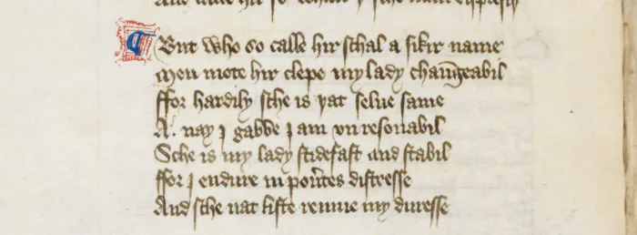

# Bastarda (Littera Bastarda, Littera Hybrida)

The Littera Bastarda was a medieval script commonly used in Europe during the 14th and 15th centuries. It was characterized by its mix of elements from both the Gothic and [Humanistic styles](humanistic-script.md), and was widely used for legal documents, religious texts, and other types of manuscripts during the late Middle Ages.

## Origin and Characteristics

The Littera Bastarda, also known as Bastard Script or Bastarda, is believed to have originated in the early 14th century, possibly in France or England. It was a transitional script that emerged as a result of the growing influence of the Humanistic script, which was based on the classical Roman script, and the Gothic script, which was prevalent in Europe during the Middle Ages.

The Littera Bastarda was a cursive script with a number of unique features. It was characterized by its irregular, fluid strokes and its mix of Gothic and Humanistic letterforms. The script was also known for its use of ligatures — the joining of two or more letters into a single glyph — which helped save space and improve legibility, important for legal documents and other official records.

The Littera Bastarda was also distinguished by its use of abbreviations, common in medieval manuscripts. Abbreviations were used to save space and speed up the writing process, but they could also make the text difficult to read, especially for modern readers unfamiliar with medieval abbreviations.

## Usage and Importance

The Littera Bastarda was widely used in Europe during the late Middle Ages: for legal documents such as charters, deeds and wills, as well as for religious texts, including bibles, missals, and psalters. The script was also used for literary manuscripts, such as the works of Chaucer, and for personal correspondence.

*Example of Littera Bastarda in Harley, ms 4866, fs001r — [The British Library](../../libraries/the-british-library-digitised-manuscripts-49.md).*

The importance of the Littera Bastarda lies in its role as a transitional script between the Gothic and Humanistic styles. It represents a period of significant change in European culture and society, as the classical ideas of the Renaissance began to take hold and influence the development of new forms of art, literature, and science.

The Littera Bastarda also had an impact on the development of printing technology. The use of ligatures and abbreviations in the script influenced the design of early printing typefaces, and the irregular strokes of the script helped inspire the development of italic typefaces.

## Decline and Legacy

The Littera Bastarda began to decline in popularity in the late 15th century, as the Humanistic script became more dominant in Europe. However, it continued to be used in certain regions, such as Spain and Portugal, well into the 16th century.

Despite its decline, the Littera Bastarda has had a lasting legacy. Its unique blend of Gothic and Humanistic letterforms has inspired the design of many modern typefaces, and its use of ligatures and abbreviations continues to influence typography and graphic design.

## Conclusion

The Littera Bastarda is a significant script that played an important role in the development of European culture and society during the late Middle Ages. Its unique blend of Gothic and Humanistic elements, its use of ligatures and abbreviations, and its role as a transitional script make it an important part of the history of typography and graphic design.

Although the Littera Bastarda has declined in popularity over the centuries, it continues to be studied and appreciated by calligraphers, typographers, and historians. Its influence can be seen in many modern typefaces and graphic designs, and its legacy as a transitional script between the Gothic and Humanistic styles has contributed to our understanding of the evolution of European art, literature, and culture.

The Littera Bastarda also serves as a reminder of the importance of preserving historical records and cultural heritage. Many important documents and manuscripts written in the script have survived to this day, providing valuable insights into the lives of people in medieval Europe.

## Bibliography

- Brown, Michelle P. *A Guide to Western Historical Scripts from Antiquity to 1600*. University of Toronto Press, 1990.
- Clemens, Raymond, and Timothy Graham. *Introduction to Manuscript Studies*. Cornell University Press, 2008.
- Clouse, Doug. "The Development of Type." In *The Art of Letterpress Printing: A Handbook for Beginners*. Bloomsbury Publishing, 2011.
- Derolez, Albert. *The Palaeography of Gothic Manuscript Books: From the Twelfth to the Early Sixteenth Century*. Cambridge University Press, 2003.
- Evans, M. B. W. *A Handlist of English Manuscripts in the Old Royal Library, British Museum*. British Museum Publications, 1962.
- Haselhoff, Gisela. *Deutsche Schreibschrift: Geschichte, Lesen, Schreiben*. Philipp Reclam Jun., 2002.
- Johnston, Edward. *Writing & Illuminating & Lettering*. Dover Publications, 1994.
- Parkes, M. B. *Pause and Effect: An Introduction to the History of Punctuation in the West*. University of California Press, 1993.
- Parkes, M. B. "The Influence of the Humanistic Bookhand on Some Gothic Scripts." *Transactions of the Cambridge Bibliographical Society*, vol. 6, no. 2, 1973.
- Prescott, Andrew. *The Palaeography of Early English Manuscripts*. Cambridge University Press, 1990.
- Brown, Michelle P. *Understanding Illuminated Manuscripts: A Guide to Technical Terms*. Getty Publications, 1994.
- Clemens, Raymond, and Timothy Graham. *The Cambridge History of the Book in Britain: Volume 2, 1100–1400*. Cambridge University Press, 2008.

Want to see Littera Bastarda manuscripts yourself? [The British Library's digitized manuscripts](../../libraries/the-british-library-digitised-manuscripts-49.md) are one of hundreds of collections on the DMMapp.

[Discover the DMMapp](../../index.md){ .md-button .md-button--primary }
