# Humanistic Script

## Why Did Humanistic Script Develop?

Humanistic script emerged in response to the difficulties readers faced with
late-fourteenth-century manuscripts written in complex styles such as
[Gothic script](gothic-littera-bastarda-littera-hybrida.md) and its derivatives.

In poor light, even an eager reader could find these scripts difficult to
decipher. Reading them required considerable effort and expertise.

For example:

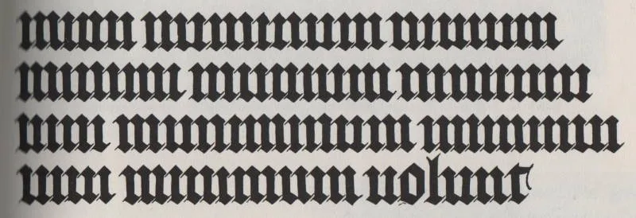
*Source: Unknown. This is a modern rendition. More info [here](https://en.wikipedia.org/wiki/Minim_(palaeography)).*

The text reads:

> *mimi numinum niuium minimi munium nimium uini muniminum imminui uiui minimum uolunt* (The snow gods' smallest mimes do not wish in any way in their lives for the great duty of the defenses of wine to be diminished.)

For an untrained reader, a manuscript like this can be daunting.

Such might have also been the sentiments of Petrarch and Coluccio Salutati, distinguished Italian scholars of the 14th century, as they manifested their desire for manuscripts to be written in a clear and legible script:

In 1366, Petrarch, then sixty-two years old and a celebrated scholar, poet, and Humanist, corresponded with his contemporary, Boccaccio, lamenting the fashion in which his 'Epistles' were being copied. He bemoaned the contemporary style of script, which he likened to that of a painter, and which he found arduous on the reader's eyes. Instead, he advocated for a "littera...castigata et clara," featuring neat and clear letters (Petrarch, *Epist. Famil.* XXIII, 19, 8).

Similarly, during the same century, Coluccio Salutati, an early Humanist in his own right, requested a copy of Abelard, a French scholastic philosopher of the 12th century, to be written in the "antica littera" — the Carolingian script — in preference to the Gothic script. His preference was driven by the belief that it was easier on his aging eyes.

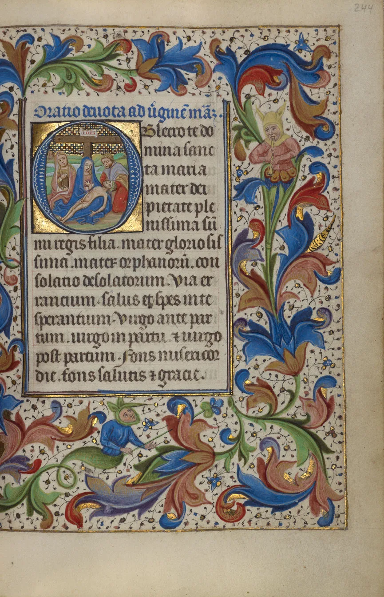
*Master of the Lee Hours, Flemish, probably Ghent, about 1450–1455. Tempera colors, gold leaf, and gold paint on parchment. MS. 2, FOL. 244, [The J. Paul Getty Museum](../../libraries/the-j-paul-getty-museum-560.md).*

The difficulties posed by the Gothic script's limited legibility are exemplified by the two episodes described above. These challenges, coupled with the growing interest among Humanists in classical texts and literature, as well as the direct influence of renowned Italian scholars on Italian society, ultimately paved the way for the development of the Humanistic script (Thomas, D. "What is the Origin of the Scrittura Humanistica?" *Bibliofilia*, 53, 1951, 1-10). The origins of this script, which superseded the Gothic script, are attributed either to Poggio Bracciolini, believed to have devised the script in its book-hand form, or to Niccolò Niccoli, credited with inspiring the cursive variation of the script, which was easier and faster to write (Ullman, B. L. *The Origin and Development of Humanistic Script*. Rome: Edizioni di Storia e Letteratura, 1960, p. 21) (Davies, M. "Humanism in Script and Print in the Fifteenth Century." In *The Cambridge Companion to Renaissance Humanism*, edited by J. Kraye. Cambridge University Press, 2006, p. 210).

The consensus among experts in the field of Humanistic script is that its genesis can be traced back to a single individual who set in motion the sequence of events that ultimately gave rise to the various forms of Humanistic script recognized today. That person is widely acknowledged to be Coluccio Salutati, an Italian scholar who played a seminal role in the development of Humanism in the 14th century.

### Coluccio Salutati

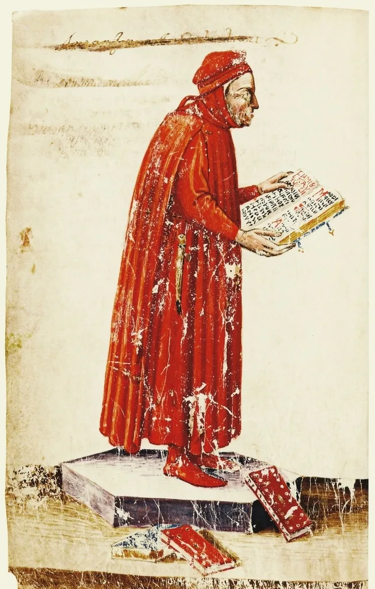
*Coluccio Salutati, in his natural environment, and displeased with his Gothic script manuscript. From a not-better-identified manuscript in the Biblioteca Medicea Laurenziana, Florence.*

Coluccio Salutati, born in 1331 in a small town near Pistoia, Tuscany, was one of the most influential men in Florence during the fourteenth century. In his life Salutati collected over 800 manuscripts, and in many of his documents that have survived to our times we can still find his handwriting in the notes surrounding the main text, written in Gothic script. Salutati also had the practice of writing his name at the end of any manuscript he owned, trying to adapt his writing style to the script he found in the text (Ullman, B. L. *The Origin and Development of Humanistic Script*. Rome: Edizioni di Storia e Letteratura, 1960, p. 12).

This is significant because, since Coluccio owned many manuscripts written in Carolingian script and added his name at the end of those texts too, he had the opportunity to practice writing in the '*antica littera*'. To adapt his style to the Carolingian script his manuscripts were written in, he started experimenting by mixing typical Gothic ligatures and forms with typical Humanistic straight "s" and "d", with a reduced use of abbreviations (ibid., p. 18). Thanks to Salutati and his script-mixing experiments, we have the first examples of the Italian semi-Gothic script — an early, crucial step towards the development of the Humanistic script. Coluccio's prominence is not limited to his experimentation, however: he also came into contact with two figures credited with the actual development of the Humanistic script, Niccolò Niccoli and Poggio Bracciolini. It was possibly Coluccio who directly inspired them.

### Niccolò Niccoli

Niccolò Niccoli was born in 1363. Son of a merchant, he invested his inheritance in manuscripts and in the study of Latin, of which he became a true connoisseur. He entered the court of Cosimo de' Medici and was ordered by him to travel through Europe and search for ancient manuscripts of authors the influential ruler of Florence admired (Davies, M. "Humanism in Script and Print in the Fifteenth Century." In *The Cambridge Companion to Renaissance Humanism*, edited by J. Kraye. Cambridge University Press, 2006, p. 51).

As mentioned in a letter by Vespasiano, a Florentine bookseller and another central figure for the spread of the Humanistic script discussed later on this page, Niccoli could write both cursive and book-hand in a beautiful and quick manner (Morison, S. "Early Humanistic Script and the First Roman Type." In *Selected Essays on the History of Letter-Forms in Manuscript and Print*, edited by D. McKitterick. Cambridge, 1981, p. 208). Similarly to Salutati, Niccolò had the habit of copying manuscripts attempting to reproduce the exact style they were originally written in, and once he established himself as a professional scribe, he also ordered other copyists working alongside him to do the same (Ullman, B. L. *The Origin and Development of Humanistic Script*. Rome: Edizioni di Storia e Letteratura, 1960, p. 72–75).

Niccoli had the desire to break traditional late-medieval book-hands, and being an expert in Latin, his main interest was in books written in that language. According to him, the '*littera antica*' was not intended for books written in the vernacular; consequently, the Italian gothic rotunda would have been a fitting script for Dante's *Divina Commedia*, but when ancient Latin texts were to be copied, a script as similar as possible to the Carolingian script was exclusively to be used (Morison, S. "Early Humanistic Script and the First Roman Type." In *Selected Essays on the History of Letter-Forms in Manuscript and Print*, edited by D. McKitterick. Cambridge, 1981, p. 209).

The main issue in understanding Niccoli's role in the development of the Humanistic script is that he hardly ever signed his manuscript works (Ullman, B. L. *The Origin and Development of Humanistic Script*. Rome: Edizioni di Storia e Letteratura, 1960, p. 60). We know of his central role thanks to the letters sent to him by three main figures in the development of this script: Salutati, who made Niccolò one of his protégés; Vespasiano, the Florentine bookseller who described Niccoli's writing style as "*bellissimo*"; and Poggio Bracciolini, the other notary indicated as the possible true inventor of the Humanistic script (ibid., p. 21).

### Poggio Bracciolini

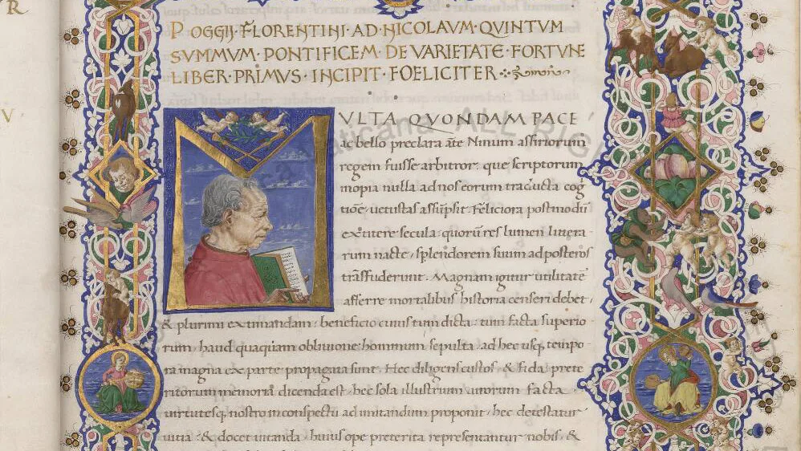
*A portrait of Poggio Bracciolini in Urb. Lat. 224, [Biblioteca Apostolica Vaticana](../../libraries/biblioteca-apostolica-vaticana-574.md).*

Poggio Bracciolini was born in 1380 and studied in Arezzo and Bologna, where he learned civil law. The course being too expensive, he abandoned the city to follow notarial studies in Florence in 1400 — a course that would take him two years rather than the eight needed to complete civil law studies. To pay for his books and studies, he would often copy manuscripts in '*littera antica*', showing a talent as a scribe (ibid., p. 22). Soon after becoming a notary, in 1403, he went to Rome, where he eventually became papal secretary. This gave him the opportunity to travel through various European capitals and, inevitably, their libraries, where he could study both the majuscules and minuscules that, together, would form the Humanistic script.

These episodes in Bracciolini's life also explain how he acquired the economic resources to train other scribes directly in his own style and contribute to the spread of the Humanistic script in Italy (ibid., p. 22); the fact that Bracciolini had the means to train scribes is fundamental to understanding how a villager managed to become one of the most influential humanists of his period and gained access to samples of the Carolingian script that eventually made him the possible originator of the Humanistic bookhand.

After briefly observing the lives of the two most influential scribes of the Humanistic script, it's fascinating to note that this script did not originate entirely in monasteries or scholarly environments, but mainly in the hands of notaries. As we've read, Bracciolini and Niccoli both worked as notaries for the Roman Catholic Church.

It's also interesting to note that the Roman Church itself was very quick in adopting this new form of writing, although, for example, it took centuries before the Vatican abandoned the use of the scroll for official acts in favour of codices. In fact, although the origin of this script can be traced back to Florence, it might never have been more than a Florentine local fashion had Pope Eugenius IV (Pope from 1431 to 1447) not reserved for the engrossing of minor documents a script similar to the Humanistic one, which later became famous as "*cancelleresca corsiva*" or chancery cursive: the Humanistic hand in its speedy form (Morison, S. "Early Humanistic Script and the First Roman Type." In *Selected Essays on the History of Letter-Forms in Manuscript and Print*, edited by D. McKitterick. Cambridge, 1981).

But it's not over — another personality who must be mentioned to argue the importance of society in the development and spread of the Humanistic script is Vespasiano da Bisticci.

### Vespasiano da Bisticci

Vespasiano da Bisticci was a "*cartolaio*", a stationer who sold parchment, paper, ink and all sorts of writing material, along with complete books (Ullman, B. L. *The Origin and Development of Humanistic Script*. Rome: Edizioni di Storia e Letteratura, 1960, p. 131). He quickly became one of the most important booksellers of the Renaissance period and was ready to accommodate orders from any part of Europe.

Cosimo de' Medici ordered from him copies of 200 manuscripts to furnish the Badia of Fiesole, giving the Florentine *cartolaio* two years to carry out the job. Vespasiano hired 45 scribes to finish the huge amount of assigned work in time. Also, in 1470, Federico da Montefeltro, Duke of Urbino, asked for his services to create a very expensive library, whose books can still be seen at the Vatican (ibid., p. 131–133). These massive quantities of manuscripts ordered by the two Italian rulers were all written in Humanistic script, either in bookhand or in cursive, and can be observed today in the Vatican Library.

As mentioned before, the Roman Church was certainly a major contributor to the spread of the script, especially in Italy; but Vespasiano can be seen as the individual who helped the Humanistic script travel beyond the Alps and into the rest of the western world.

## The Origin and Development of Humanistic Script

Now that we've met the key individuals who contributed to the development of the Humanistic script, it's time to look at the development of the script itself.

### The Reaction Against Gothic Script

Palaeography experts Ullman, Davies, and Morison see in the Humanistic script a reaction to the "over-complicated and barbaric" Gothic script. Comparing the two types of handwriting, the reasons for this appear clear: overelaboration of letterforms, small size of the script, and abundant use of non-standardized abbreviations all rendered Gothic script in its various forms (*quadrata, fracta, praecissa,* and *rotunda*) undesirable to scholars on the Italian peninsula (although in the south of Italy the [Beneventan script](beneventan-script.md) was still written and used until the sixteenth century, though it had been in decline since the eleventh).

The rejection of the Gothic Script led to a search for a more "user-friendly" script, and Italian Semi-Gothic began to develop (Clemens, R., and T. Graham. *Introduction to Manuscript Studies*. Cornell University Press, 2007, p. 172). This type of script was already influenced by the '*littera antica*', but it's in the later, fully-developed Humanistic Bookhand that its influence is most evident.

### Why Humanistic and Beneventan Scripts Had Different Fates

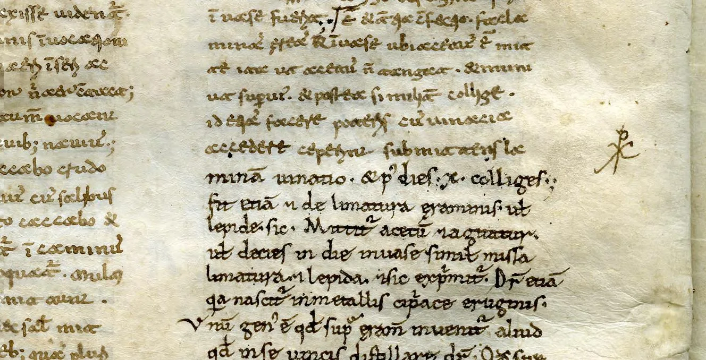
*A beautiful example of Beneventan script transitioning into Carolingian, [Universitaire Bibliotheken Leiden](../../libraries/universitaire-bibliotheken-leiden-364.md), VLQ 1.*

In the thirteenth century Florence was the centre of the humanistic world and became the birthplace of the Humanistic script (Thomas, D. "What is the Origin of the Scrittura Humanistica?" *Bibliofilia*, 53, 1951, 1-10), which developed very quickly and soon spread through Italy and beyond the Alps. But why didn't this script face the same fate as the Beneventan Script? [Beneventan](beneventan-script.md), so called because its centre of production was Benevento in Southern Italy, is a script that originated in the eighth century and was used until the thirteenth century, roughly the same period as the Carolingian Minuscule. Although it was used for six centuries, it never spread beyond southern Italy and the zones in Dalmatia influenced by Beneventan monastic houses (Clemens, R., and T. Graham. *Introduction to Manuscript Studies*. Cornell University Press, 2007, p. 152).

The Humanistic script, on the other hand, developed at the end of the fourteenth century, and by the first decades of the next century it was already found in Ferrara, Bologna and Venice (Ullman, B. L. *The Origin and Development of Humanistic Script*. Rome: Edizioni di Storia e Letteratura, 1960, p. 86). By 1455 the script would be in Subiaco, near Rome, ready to influence the first types used in Italian printing presses. How? Simple: many early humanists came to Florence, discussed humanistic topics, and eventually bought locally-copied manuscripts written in Humanistic Script, carrying the script home to different parts of Italy (Davies, M. "Humanism in Script and Print in the Fifteenth Century." In *The Cambridge Companion to Renaissance Humanism*, edited by J. Kraye. Cambridge University Press, 2006, p. 50–53).

Moreover, in the same period, the kings of Aragon decided to create a new library in Naples and, intriguingly, rather than relying on the Beneventan script typical of the area (Benevento is just fifty kilometres north-east of Naples), they chose the Humanistic script. Scribes from Florence travelled to southern Italy to write the manuscripts necessary to fill the newborn library (Thomas, D. "What is the Origin of the Scrittura Humanistica?" *Bibliofilia*, 53, 1951, 1-10).

Soon the script would dominate in many other libraries, such as those in Urbino and Cesena, but also in Hungary, where King Matthias Corvinus would create one of Europe's greatest collections of secular books (Chisholm, H. "Matthias I, Hunyadi." In *Encyclopaedia Britannica*, 11th ed. Cambridge University Press, 1911).

### Humanistic Script for Humanistic Books

But in which type of manuscript was the Humanistic script mainly used? We actually don't know. A clear and complete analysis of the typology in which this script was mainly adopted doesn't appear to be available yet. Martin Davies, an expert in Humanistic script, simply states that "Humanistic script was used for Humanistic texts" (Davies, M. "Humanism in Script and Print in the Fifteenth Century." In *The Cambridge Companion to Renaissance Humanism*, edited by J. Kraye. Cambridge University Press, 2006, p. 49), and this appears to be true: due to the humanists' interest in the Classics, many transcriptions of Latin and Greek were written mainly in Humanistic bookhand and have survived to our times.

Texts in Italian vernacular written in Humanistic script and dated before 1450 are difficult to find, and even after that date the script's presence in vernacular texts isn't so common (ibid., p. 49). Manuscripts on professional matters useful to lawyers, philosophers and physicians continued to be written in Gothic script (ibid., p. 49).

There are also examples of Humanistic script used in various Books of Hours, while the only example of a Bible written in Humanistic script we were able to find is the "Urbinate Bible". This is a massive Vulgate bible ordered by none other than Federico da Montefeltro, Duke of Urbino, from Vespasiano da Bisticci, the Florentine bookseller.

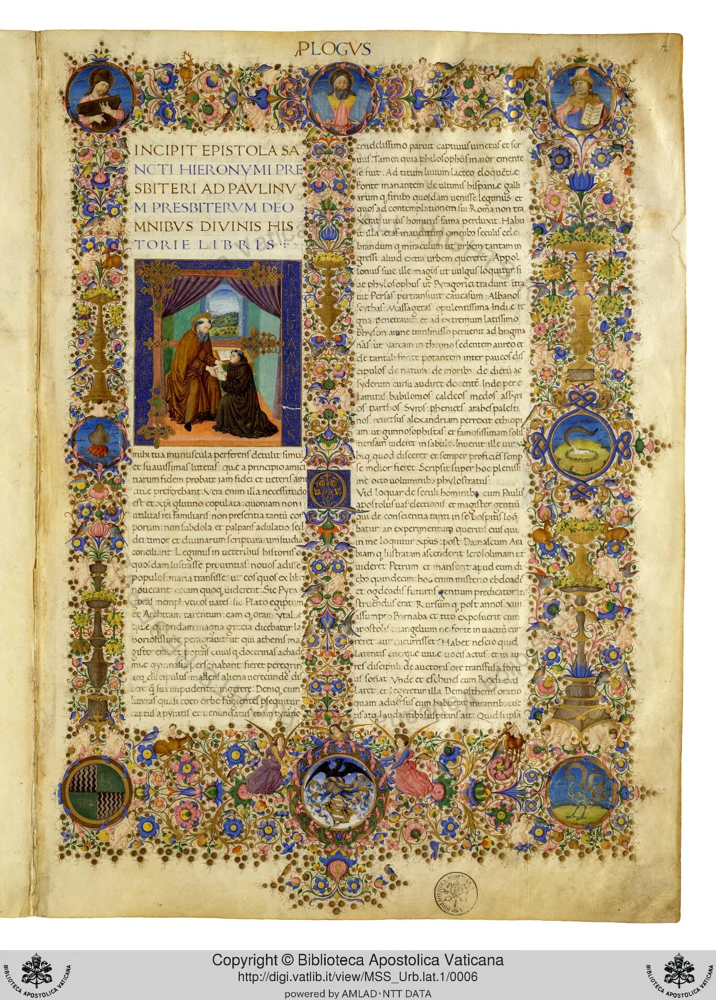
*The Urbinate Bible, Urb. Lat. 1, f. 2r, [Biblioteca Apostolica Vaticana](../../libraries/biblioteca-apostolica-vaticana-574.md).*

### The Influence of the Carolingian Script

We've been referring to a '*littera antica*', a synonym for Carolingian Script, and mentioned that it directly influenced the Humanistic script. But how can this influence be proven? To answer this, we need to look closely at ancient texts and compare letters and details from the two scripts. Let's do that.

Let's observe this image from the Stuttgart Psalter, an illuminated Carolingian manuscript written at Saint-Germain-des-Prés circa 830.

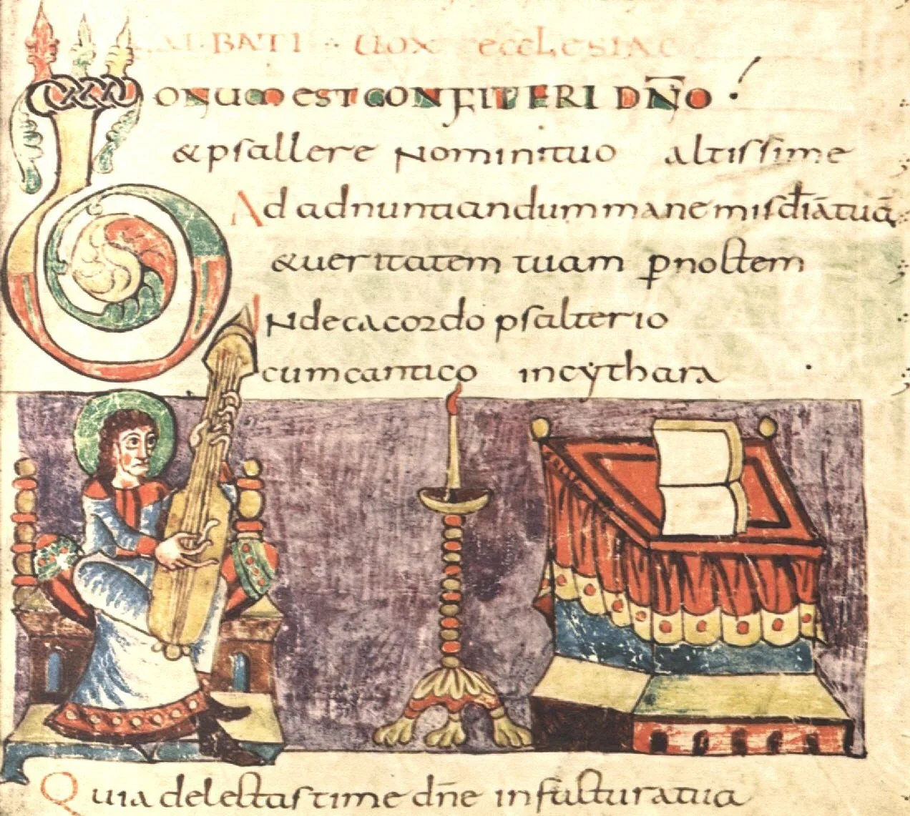
*The Stuttgart Psalter, Saint-Germain (France), 820–830, [Württembergische Landesbibliothek](../../libraries/wurttembergische-landesbibliothek-253.md), Stuttgart (Germany).*

What we can notice here are a series of important details. The most evident is the uppercase "Q" in "*quia*" in the very last line at the end of the visible page — there's a very long "tail" which continues under the following "u". Let's now observe Poggio Bracciolini's script in the following image:

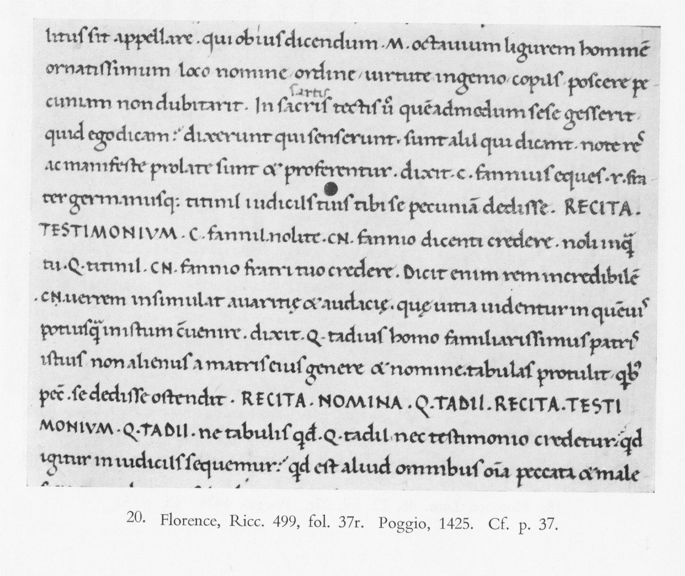
*Bracciolini's book-hand, from Ullman, B. L. The Origin and Development of Humanistic Script. Rome: Edizioni di Storia e Letteratura, 1960, Appendix.*

The capital "Q" in line eight is written in the same fashion. In line two of our Carolingian sample, the second word is "*psallere*". In Poggio's writing, the letter "s" is written in almost exactly the same way. Observe the word "*sotto*" in line one: even the small detail of the "ear" — that small stroke extending from the upper-left side of the Carolingian "s" — is copied. In line three of the Carolingian sample, the ampersand "&" looks extremely similar to Bracciolini's in line five.

## Majuscules in Humanistic Script

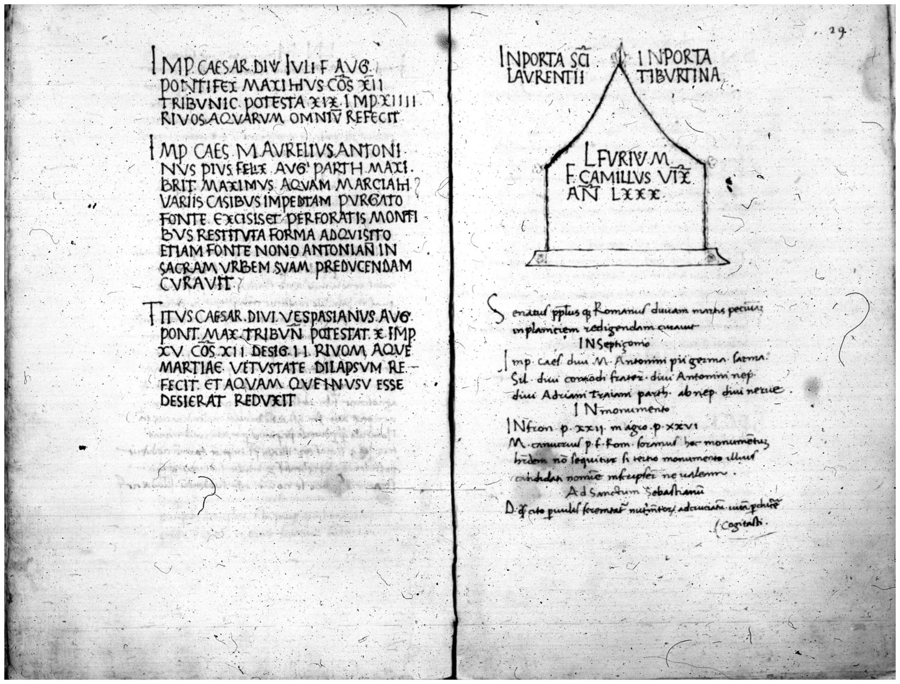
*Vat. lat. 9152 f28v-29r, Poggio Bracciolini's "Sylloge", [Biblioteca Apostolica Vaticana](../../libraries/biblioteca-apostolica-vaticana-574.md). Not digitized yet.*

This is probably a good time to discuss another important detail of the Humanistic script: the majuscules. It must be noted that Carolingian manuscripts mainly inspired the Humanistic minuscule. What about majuscules? Those came from somewhere completely different: inscriptions. But why would letters not found on ancient manuscripts inspire the Humanist scribes? As mentioned before, humanist scribes thought that the Carolingian script was the original script used by ancient Roman authors.

When humanist scribes travelled to Rome (as Bracciolini and Niccoli did because of their professions as notaries for the Church), they had samples of true ancient majuscules sculpted in marble in front of them, and decided to copy these rather than the ones found on manuscripts (Meiss, M. "Towards a More Comprehensive Renaissance Paleography." *The Art Bulletin*, 42, 1960, p. 97–98).

Need proof? Our friend Poggio Bracciolini collected the inscriptions he found in Rome and eventually published a whole book about them called "Sylloge" (Ullman, B. L. *The Origin and Development of Humanistic Script*. Rome: Edizioni di Storia e Letteratura, 1960, p. 54–56). Since these inscriptions are still visible today, we have a precise idea of which specific style was most influential in the Humanistic script's majuscule: Imperial and formal inscriptions (ibid., p. 56).

This is why the "Q" used in our Carolingian example above is so similar to the same letter written in ancient Rome. As Poggio developed the Humanistic minuscule based on the Carolingian's, Carolingian scribes had developed their majuscules on the ancient Romans' (Meiss, M. "Towards a More Comprehensive Renaissance Paleography." *The Art Bulletin*, 42, 1960, p. 98). Bracciolini probably thought of this and went directly to the source to develop his own capital letters (Ullman, B. L. *The Origin and Development of Humanistic Script*. Rome: Edizioni di Storia e Letteratura, 1960, p. 56).

## Humanistic Script’s Influence on Modern Typography

As you'd imagine, all the events regarding the Humanistic script that took place in Italy during the early Renaissance became very deeply influential when the first printing presses came to the abbey of Subiaco in Italy during the second half of the fifteenth century.

Clearly, the Humanistic script influenced the fonts produced (Italic and Roman), mainly because, as we've seen, it was intensely used near Rome (Davies, M. "Humanism in Script and Print in the Fifteenth Century." In *The Cambridge Companion to Renaissance Humanism*, edited by J. Kraye. Cambridge University Press, 2006, p. 51–53). It shouldn't surprise us, then, that by the end of the fifteenth century, in the *Hypnerotomachia Poliphili* printed by Aldo Manuzio, we find a type so similar to the written Humanistic script.

Need proof? Let's use a method similar to the one used to compare the Gothic script to the Humanistic. We'll use samples of printed products from the period, next to a sample in Humanistic hand: in Bracciolini's example above, we have text written by him in 1425. Let's pay attention to the following letters: "s" in "*obious*", line one; "g" in "*ligurem*", line one; "a" in "*ornatissimum*", line two; "&" in line five; "Q" in line eight.

Now let's observe a print of the *Hypnerotomachia Poliphili* (The Strife of Love in a Dream) by Francesco Colonna, the greatest achievement of the greatest printer of the Renaissance, Aldus Manutius.

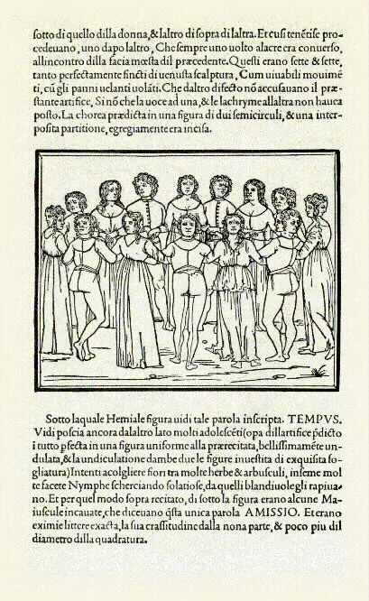
*Hypnerotomachia Poliphili (The Strife of Love in a Dream), Francesco Colonna, printed by Aldus Manutius, Venice, 1499.*

It was printed in Venice in 1499, seventy-four years after Bracciolini's sample. The similarities in Manutius' print start with word one, line one: the "S" in "S*otto*" is very similar to Poggio's. Let's now observe the "g" in "*figura*", line seven — the structure is very similar between the two samples: two different bodies, one above the baseline and one under it, joined by a "link".

The letter "a" is particularly interesting: while Poggio, in his bookhand, kept the traditional form of the letter (the "a" with a "finial" on top of the body of the letter, also seen in Aldus' print), in his cursive, Niccoli developed the "a" without the finial. Compare Niccoli's hand to another sample from Manutius, this time printed in italic:

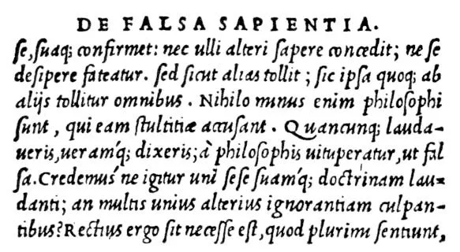
*Lucius Caecilius Firmianus Lactantius, De Falsa Sapentia, printed by Aldus Manutius, Venice, c. 1500.*

The "&", standing for the Latin word "*et*" ("and"), kept its meaning to this day. Observe its form in line five of Bracciolini's sample, in line three of Niccoli's, and in line one of Manutius' sample — and in line three of the Carolingian script sample above. All of them are very similar to each other.

Finally, let's observe the letter "Q". The most distinctive detail in both Niccoli and Bracciolini's uppercase letter is the very long and curved end below the baseline, tending to run under the following letter. Surprisingly, Manutius' font keeps the same letter structure in line three: the curved end of the "Q" in "*Quelli*" continues under the letter "u", although founding and setting such a complex letter in a period press must have been tricky — but that's style.

As an extra proof of the Humanistic script's influence on modern typography: this blog was published using the "Lora" font, derived from the Humanistic script. The famous "Palatino" typeface, designed by Hermann Zapf in 1948 and named after the Italian calligrapher Giambattista Palatino, was inspired by the humanistic bookhand and adapted to contemporary readability needs (Zapf, H. "Hermann Zapf Biography." Linotype.com, accessed December 4, 2011).

When printing came to Italy, it led to the end of copying in Humanistic script. Some copyists, to avoid going completely out of business — such as Sinibaldi, an Italian scribe who declared that printing had reduced his workload so much he was barely able to afford clothes — decided to become proofreaders for the printers.

## Lasting Influence

The success of the Humanistic script in the fourteenth and fifteenth centuries was due to multiple, closely-linked factors that subsequently led to the development of the script.

The interest of early humanists in Latin and Greek classics was one of the main causes of the development of the Humanistic script. Without this interest from Petrarch, Boccaccio and Salutati, there wouldn't have been the influence that guided the scribes Poggio Bracciolini and Niccolò Niccoli towards the development and promotion of this clear and very readable script. We've also seen how a book dealer and broker like Vespasiano was responsible for spreading the script in Italy and, most importantly, beyond the Alps, with the help of the Roman Church, which played a central role in affirming the script's usefulness, not only in manuscript books but also in official settings.

Putting these elements together, the deep relationship between early Renaissance Italian society and the origin of the Humanistic script becomes evident. The Humanistic script is one of the most important scripts in manuscript history, yet it appears not to have been thoroughly researched still.

There are still doubts about "who" was the true "inventor" of the script. Ullman, one of the most influential authors and researchers on the Humanistic script, argues that Niccolò Niccoli was only the developer of the Humanistic cursive, while Poggio Bracciolini should be considered the inventor of the Humanistic bookhand. Ullman then criticizes Morison, who instead believed that Niccoli was the inventor of both forms of the Humanistic script. None of these authors, however, managed to deliver definitive proof of their beliefs. Their books were written in the 1960s and, even though there are many unclear details about the script that should be researched, more recent research and articles appear to be difficult to find. Here are several questions we were unable to find answers to:

- Vespasiano's role in the spread of the Humanistic script in the western world should be researched more thoroughly. It's known that he sold manuscripts written in Humanistic script to customers around Europe, and that he hired many scribes to carry out the orders he received. What we don't know is whether it was his direct order to the scribes he hired to write in Humanistic script, or the scribes' own choice, or whether Vespasiano's clients specifically asked for their books to be written in that fashion.
- A complete analysis of which types of books the script was mainly used for is also still non-existent — probably because a catalogue indicating all the manuscripts written in Humanistic hand is also non-existent. Such a catalogue could be very useful and could speed up research.
- Furthermore, as far as we know, few in-depth studies have been done on the library ordered by the Duke of Urbino from Vespasiano, now held at the Vatican Archive in Rome. The "Urbinate Bible", one of the few Bibles written in Humanistic script, has had little published research done on it. If you have any tips on books, articles, or dissertations, let us know!

The Humanistic script therefore still appears to be hiding many secrets that, once unfolded, might cast light not only on further understanding of the Humanistic script itself, but also on the whole humanist movement of the Renaissance.

*(This is an edited version of an old essay originally written for Academia.edu.)*

Want to see Humanistic script manuscripts yourself? The [Vatican Library](../../libraries/biblioteca-apostolica-vaticana-574.md), the [Getty Museum](../../libraries/the-j-paul-getty-museum-560.md), and [Universiteitsbibliotheken Leiden](../../libraries/universitaire-bibliotheken-leiden-364.md) are three of hundreds of collections on the DMMapp.

[Discover the DMMapp](../../index.md){ .md-button .md-button--primary }
